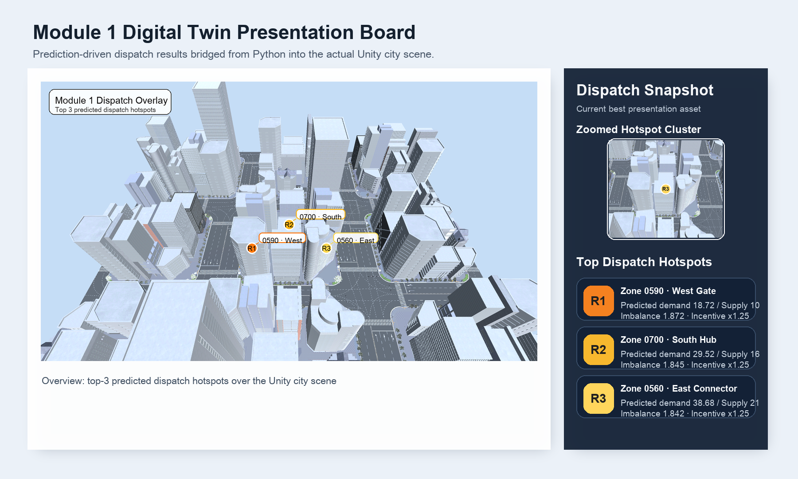

# A-Eye
카카오모빌리티 - AI 기반 택시 수요 예측 및 동적 배차 시스템 (캡스톤디자인)

## 프로젝트 개요
이 저장소는 캡스톤 1차 기준의 오프라인 프로토타입을 담고 있습니다.

- 로컬 택시 수요 데이터 생성
- 시공간 피처 전처리
- baseline 수요 예측
- 예측 결과 기반 rule-based 배차 추천
- 결과 시각화 및 요약 파일 생성

현재 기준으로 Python 파이프라인은 실행 가능하며, Module 1은 Unity 실제 씬 브리지까지 연결된 상태입니다.

## 최근 업데이트 로그

### 2026-03-31
- 서울 Open API 기반 공공데이터 fetch 파이프라인 추가
- baseline 수요 예측 결과를 배차 로직에 직접 연결
- 배차 전/후 비교 지표 및 시각화 추가
- Unity Module 1 브리지 구현
  - `dispatch_recommendations.csv` → `unity_scenario.json` → Unity 씬 생성
- Unity 결과를 발표용 보드 이미지로 정리

### 현재 확인된 상태
- 로컬 더미데이터 기준: 예측, 배차, 시각화 실행 가능
- 서울 공공데이터 기준: fetch, 변환, 예측, 배차, Unity 시각화 실행 가능
- SUMO는 아직 미구현, Unity만 실제 실행 확인 완료

### Module 1 현재 결과



- 발표용 보드: `docs/assets/unity_module1_presentation.png`
- Unity 원본 캡처: `outputs/module1/unity_module1_view.png`
- Unity 오버레이 캡처: `outputs/module1/unity_module1_annotated.png`
- Unity 시나리오 입력: `outputs/module1/unity_scenario.json`

## 빠른 실행
```bash
git clone https://github.com/kimcanal/A-Eye.git
cd A-Eye
python3 -m venv .venv
source .venv/bin/activate
pip install -r requirements.txt
bash scripts/run_pipeline.sh
```

## 공공데이터 실험 실행
서울시 행정동별 대중교통 총 승차 승객수 데이터를 붙이는 실험 경로도 추가되어 있습니다.

```bash
cd <repo-root>
source .venv/bin/activate
bash scripts/run_public_pipeline.sh
```

설명 문서:
- `docs/17_public_data_quickstart.md`
- `planning/public-dataset-plan.md`

## 실행 결과
파이프라인을 실행하면 아래 산출물이 생성됩니다.

- `outputs/processed_taxi_calls.csv`
- `outputs/model_metrics.json`
- `outputs/predictions.csv`
- `outputs/dispatch_recommendations.csv`
- `outputs/dispatch_comparison.csv`
- `outputs/dispatch_evaluation.json`
- `outputs/dispatch_before_after.png`
- `outputs/hourly_demand.png`
- `outputs/zone_hour_heatmap.png`
- `outputs/actual_vs_predicted.png`
- `outputs/zone_demand_summary.csv`
- `outputs/hourly_demand_summary.csv`

## 폴더 구조
- `configs/`: 실행 설정
- `data/`: 샘플/생성 데이터
- `src/data/`: 로컬 데이터 생성
- `src/preprocessing/`: 전처리 및 피처 생성
- `src/prediction/`: baseline, LSTM 예측 코드
- `src/dispatch/`: 배차 우선순위 계산
- `src/analysis/`: 요약 CSV 생성
- `src/visualization/`: 그래프 생성
- `module1_simulation/`: Module 1 최소 시뮬레이션 스텁
- `docs/`: 발표/계획/Unity/phase1 문서
- `references/`: 과제 명세서 원문

## 현재 기준 권장 흐름
1. `scripts/run_pipeline.sh`로 1차 오프라인 흐름 실행
2. `outputs/` 결과와 `docs/12_phase1_guide.md` 확인
3. `predictions.csv`와 `dispatch_recommendations.csv`로 예측-배차 연결 확인
4. `dispatch_before_after.png`와 `dispatch_evaluation.json`으로 배차 전/후 효과 확인
5. 이후 LSTM, 실시간 데이터, Unity 시각화 순으로 확장

## LSTM 관련
`src/prediction/train_lstm.py`는 PyTorch가 필요합니다.

```bash
cd <repo-root>
pip install torch
.venv/bin/python -m src.prediction.train_lstm
```

이 단계는 선택적인 고도화 단계이며, 기본 파이프라인에는 포함되지 않습니다.

## Module 1 / Unity 문서
- `docs/01_module1_compendium.md`
- `docs/06_team_guide_module1.md`
- `docs/07_unity_workflow_checklist.md`
- `docs/08_module1_code_map.md`
- `docs/18_module1_visualization_guide.md`

Module 1 최소 시각화 실행:

```bash
cd <repo-root>
bash scripts/run_module1.sh
```

생성 결과:
- `outputs/module1/module1_overview.png`
- `outputs/module1/module1_simulation.gif`

Unity 실제 브리지 실행:

```bash
cd <repo-root>
bash scripts/run_unity_module1_capture.sh
```

생성 결과:
- `outputs/module1/unity_module1_view.png`
- `outputs/module1/unity_module1_annotated.png`
- `outputs/module1/unity_module1_presentation.png`
- `outputs/module1/unity_scenario.json`

입력 배차 결과 선택:
- 기본값은 `outputs/seoul_public/dispatch_recommendations.csv`와 `outputs/dispatch_recommendations.csv` 중 최신 수정 파일입니다.
- 강제로 지정하려면 아래 중 하나를 사용합니다.

```bash
export DISPATCH_SOURCE=public   # 또는 local
bash scripts/run_unity_module1_capture.sh
```

```bash
export DISPATCH_CSV="/absolute/path/to/dispatch_recommendations.csv"
bash scripts/run_unity_module1_capture.sh
```

주의:
- 기본값으로 macOS 일반 설치 경로와 `~/Downloads/PBL_AssetPackge/Modeling/New Unity Project`를 사용합니다.
- 다른 환경에서는 실행 전에 아래처럼 환경변수로 경로를 지정하면 됩니다.

```bash
export UNITY_APP="/Applications/Unity/Unity.app/Contents/MacOS/Unity"
export UNITY_PROJECT="/path/to/your/UnityProject"
bash scripts/run_unity_module1_capture.sh
```

## 참고 링크
- Notion: https://nimble-ceder-40b.notion.site/28_DT_-32317efd202c8158b35ac245c2b4dc73
